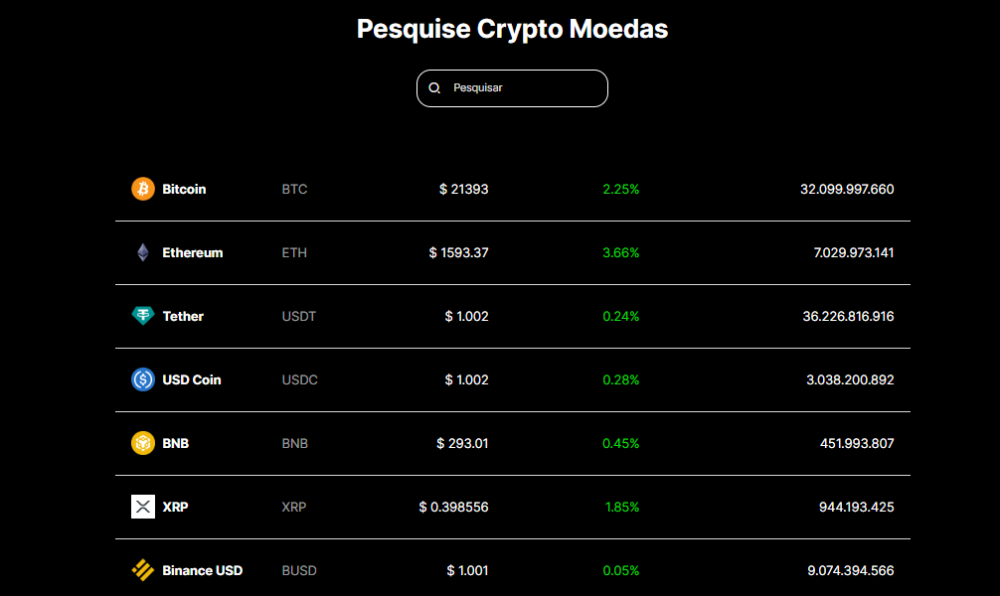

# Consulta de Cripto Moedas via API 

Projeto feito utlizando a API CoinGenko 


## Referência

 - [Link API](https://www.coingecko.com/en/api/documentation)
 

## Instalação

Instale o projeto com npm 

```bash
  npm install 
  cd project
  npm run dev 
```
    
## Screenshots



